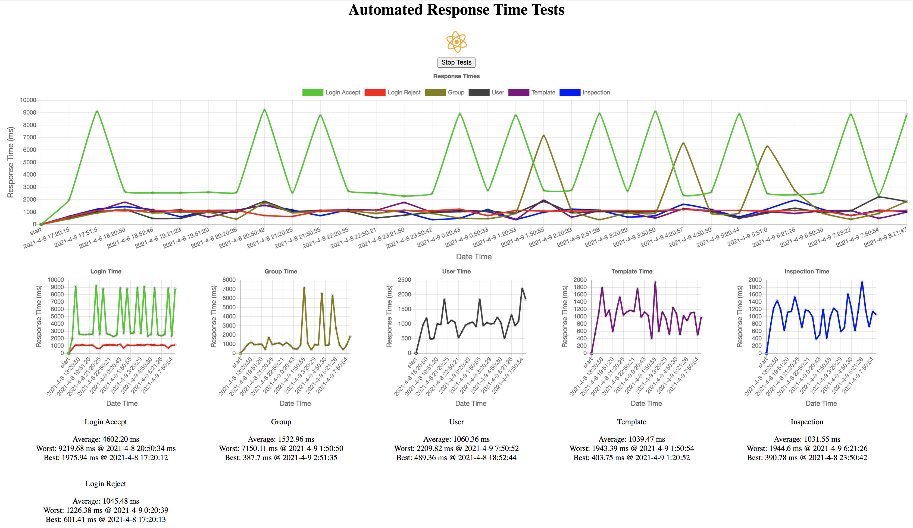

# API Response Time Testing

This application is used to test the time it takes to get a response from the API. 

Here's a sneaky peek of what's to come:


### API Endpoints
For your convenience we have written an overview of the API endpoints that we have targeted. 
For even more convenience this information can also be found within the application (try hovering over the table names above the averages).  

Login: **/auth**
<!-- - retrieves api Token used throughout all other api calls -->

Groups: **/share/connections**
<!-- - retrieves all of the groups that the logged in user is apart of  -->
<!-- - returns a list of groups containing objects with id's and name's for each group -->

Users: **/groups/<group_id>/users**
<!-- - retrieves all of the users within the specified group id  -->
<!-- - returns user details such as email, status, and user_id -->

Inspections: **/audits/search?field=audit_id&field=modified_at**
<!-- - retrieves inspection data  -->
<!-- - returns a list of objects containing the audit_id and modified_at fields for each inspections -->

Templates: **/templates/search?field=template_id&field=modified_at**
<!-- - retrieves template data -->
<!-- - returns list of objects containing the template_id and modified_at date -->

_Please Note: All api calls use the sandpit api as the base url. If you're feeling adventurous and want to try it out on the real thing feel free to change it (location: react-postgres/src/App.js line 7). Be warned that this is untested territory and everything may explode. 💥_  


## Installation

_These installation steps assume you have PostgreSQL installed._

Setup PostgreSQL Database:
1. Open PostgreSQL in the terminal.
2.  Copy and paste the following:
```
CREATE USER admin WITH PASSWORD 'purplelobstermountain';
ALTER USER admin WITH SUPERUSER;
CREATE DATABASE sc_database;
GRANT ALL PRIVILEGES ON DATABASE sc_database TO admin;
```
3. Navigate to the newly created database as admin user: `\c sc_database admin`
4. Copy and paste the following:
```
CREATE TABLE access_token (
    id SERIAL PRIMARY KEY,
    response_ok BOOLEAN,
    time NUMERIC,
    num_items_retrieved INTEGER,
    date_time TIMESTAMP
);
CREATE TABLE groups (
    id SERIAL PRIMARY KEY,
    response_ok BOOLEAN,
    time NUMERIC,
    num_items_retrieved INTEGER,
    date_time TIMESTAMP
);
CREATE TABLE users (
    id SERIAL PRIMARY KEY,
    response_ok BOOLEAN,
    time NUMERIC,
    num_items_retrieved INTEGER,
    date_time TIMESTAMP
);
CREATE TABLE templates (
    id SERIAL PRIMARY KEY,
    response_ok BOOLEAN,
    time NUMERIC,
    num_items_retrieved INTEGER,
    date_time TIMESTAMP
);
CREATE TABLE inspections (
    id SERIAL PRIMARY KEY,
    response_ok BOOLEAN,
    time NUMERIC,
    num_items_retrieved INTEGER,
    date_time TIMESTAMP
);
```

Set up the application:
1. Clone the repo `git clone https://github.com/macca-lachlan/SafetyCultureInternship.git`
2. Open two terminals and, in each, navigate into the newly cloned repo directory.
3. In the first terminal set up the server with the following commands:
   - `cd server`
   - `npm install`
   - `nodemon index`
   - You should see "Server started on port 5000." printed to the terminal
4. In the second terminal start the react app with the following commands:
   - `cd react-postgres`
   - `npm install`
   - `npm start`
   - The application should pop open in your favorite browser
5.  Login and enjoy!


<!-- ## Super Cool Features -->

## Features To Come!
<!-- - Use tooltip to show which endpoint is being called in the app. -->
<!-- - more detailed data about why the time may be slow? -->
- Charts that show data for the last 24 hours, week, 2 weeks, 1 month.
<!-- - deploy to a website -->

<!-- ## Known Bugs (???) -->
